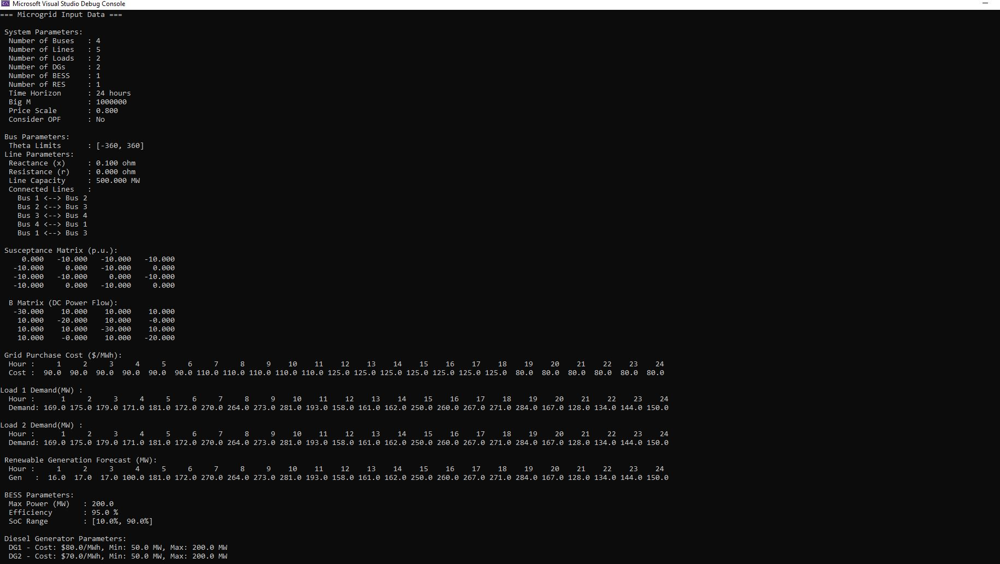
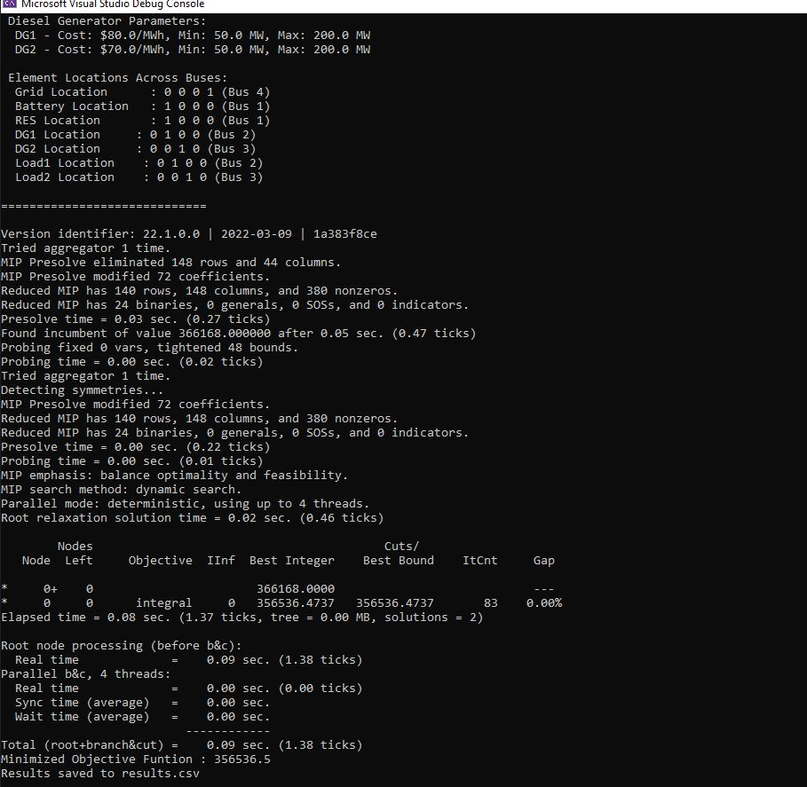

# Advanced System Operation – Seminar Presentation Repository

This repository contains the seminar content developed and presented by **Talha Rehman** for the course **Advanced System Operation** at **Incheon National University, South Korea**.

The project demonstrates the modeling and solution of optimization problems in power system operations using **C++** and **CPLEX**, along with a visual presentation hosted via **GitHub Pages**.


## 🧠 Topics Covered

* Microgrids Overview
* Economic Dispatch and Optimal Power Flow
* Optimization Modeling using CPLEX with C++
* Operational Constraints in Power Systems

## 🔗 Live Project Page

Visit the seminar presentation here:  
👉 [Project Page on GitHub Pages](https://talharehmanmtrkt.github.io/seminar-content-ASO/)


## 📁 Repository Structure

```bash
seminar-content-ASO/
├── code/                    # C++ source code and Visual Studio project files using CPLEX
├── images/                  # All images used in HTML content
├── index.html               # Main landing page for GitHub Pages
├── code_implementation.html# Detailed explanation of code implementation
├── styles.css               # CSS styles for the HTML pages
├── script.js                # JavaScript interactions
├── LICENSE                  # MIT License
└── README.md                # This file
```

## ⚙️ Requirements

* **Operating System**: Windows (recommended for Visual Studio projects)
* **Visual Studio**: 2019 or later
* **IBM ILOG CPLEX Optimization Studio**: v22.1.0 or later
* Properly set up environment variables for CPLEX (`CPLEX_STUDIO_DIR`, include/lib paths).

## 🚀 How to Run

1. Clone this repository:

   ```bash
   git clone https://github.com/TalhaRehmanMTRKT/seminar-content-ASO.git
   cd seminar-content-ASO/code
   ```
2. Open the Visual Studio project (`.sln` file).
3. Make sure CPLEX is correctly installed and linked in project properties. If you want to setup the CPLEX with VS follow this tutorial: https://youtu.be/k_Z-F8nbXjU?si=pNkK4ZjboQaw3nvx
4. Build and run the project.

Below are example output screenshots. If you have correctly run the C++/CPLEX code, your output window should look similar to the following:

#### ✅ Output Example – Part A



#### ✅ Output Example – Part B



After successfully running the C++/CPLEX code, the results of the operation will be saved as `.csv` files in the `/code` folder.

The generated files depend on the value of the `consider_opf` flag in the code:

- **If `consider_opf` is set to `false`:**
  - Only one result file will be generated:
    - `results.csv` → Contains the operational results for 24 hours (generation schedule, load served, etc.)

- **If `consider_opf` is set to `true`:**
  - Three separate `.csv` files will be generated:
    - `results.csv` → Operation results for 24 hours
    - `powerflow.csv` → Power flow values across the network for each hour
    - `theta.csv` → Voltage angle results over 24 hours


## 📄 License

This repository is licensed under the [MIT License](LICENSE).

## 🙋‍♂️ Author

**Talha Rehman**
🔗 [LinkedIn](https://www.linkedin.com/in/muhammad-talha-rehman-khan-tareen/) |
🐙 [GitHub](https://github.com/TalhaRehmanMTRKT) |
🎓 [Google Scholar](https://scholar.google.com/citations?user=j_AybA4AAAAJ&hl=en)

---


